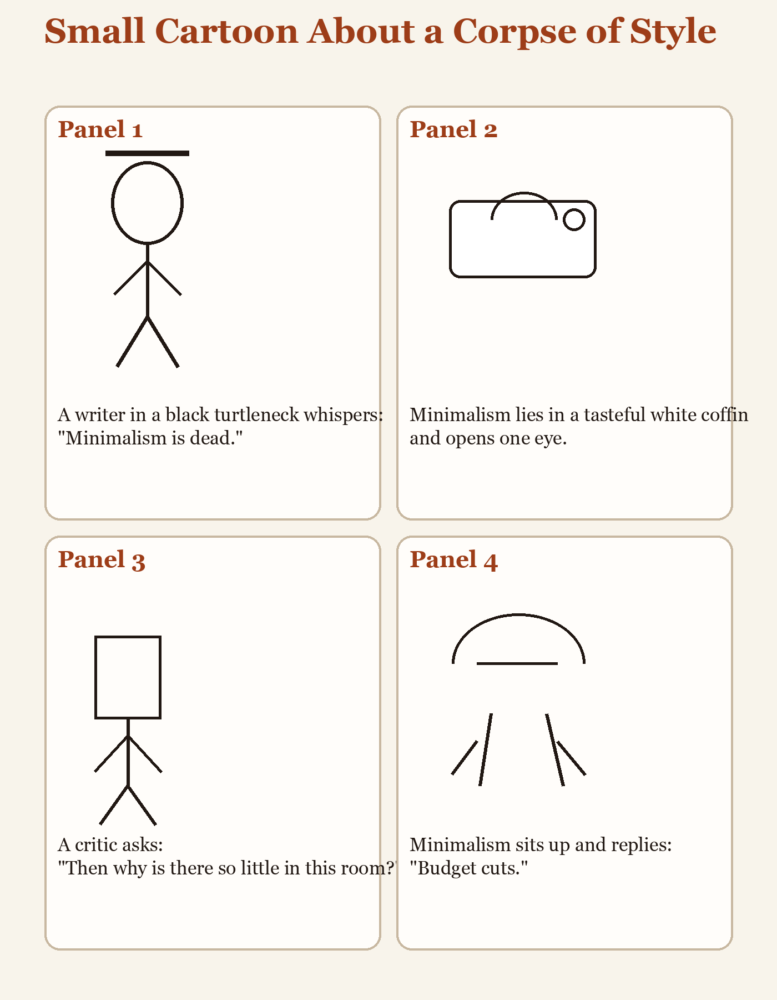

# Small Cartoon About a Corpse of Style

**Panel 1**  
A writer in a black turtleneck whispers, "Minimalism is dead."

**Panel 2**  
Minimalism, lying in a tasteful white coffin, opens one eye.

**Panel 3**  
A critic says, "Then why is there so little in this room?"

**Panel 4**  
Minimalism sits up and replies, "Budget cuts."
