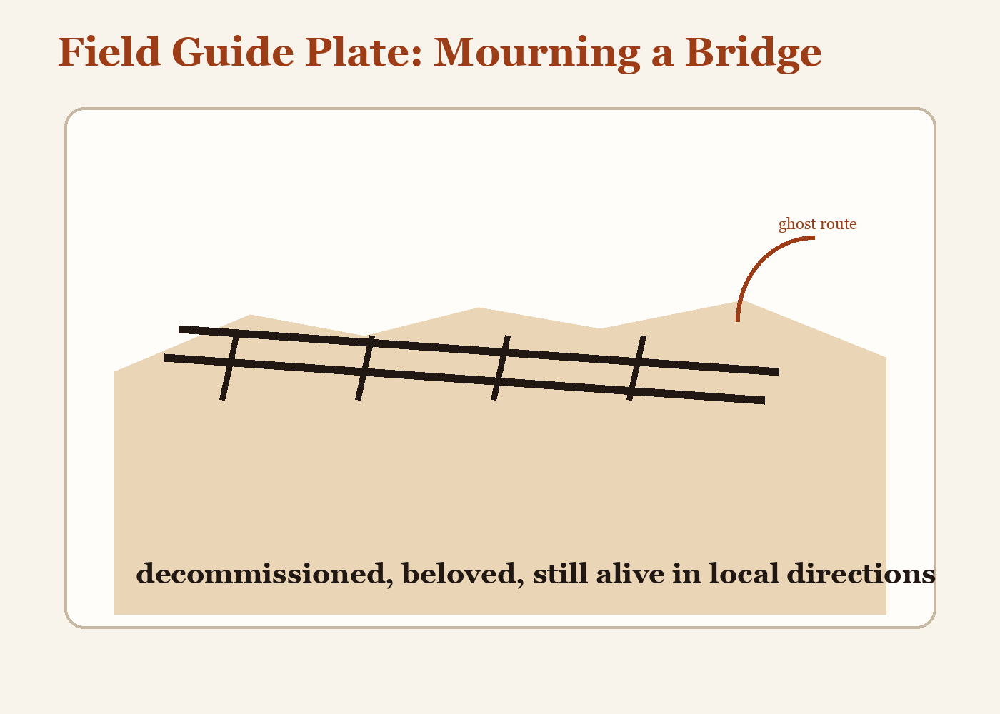

# Field Guide Entry: Mourning a Bridge

**Species:** iron footbridge, municipal  
**Habitat:** crossing between habit and inconvenience  
**Status:** decommissioned, beloved

Identification: rust at the joints, handrails polished by several generations of indecisive palms.

Behavior: encouraged shortcuts, first kisses, smoked arguments, and dramatic pauses over water.

Cause of death: replacement by a larger bridge optimized for vehicles and other unromantic speed.

Notes: although physically demolished, the bridge survives in local directions. Residents continue to say, "Turn left where the old bridge was," proving that structures enjoy a second life in grammar.
