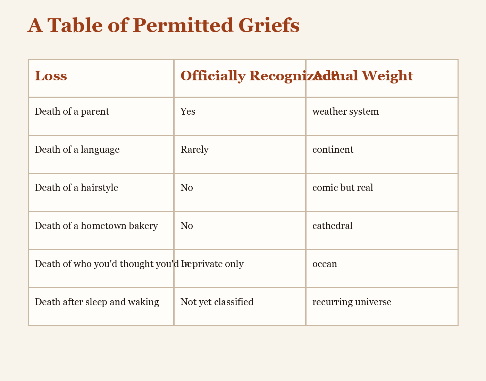

# A Table of Permitted Griefs

| Loss | Officially Recognized? | Actual Weight |
| --- | --- | --- |
| Death of a parent | Yes | weather system |
| Death of a language | Rarely | continent |
| Death of a hairstyle | No | comic but real |
| Death of a hometown bakery | No | cathedral |
| Death of who you thought you'd be | In private only | ocean |
| Death after sleep and waking | Not yet classified | recurring universe |

The table is provisional and should not be trusted more than your own chest.
