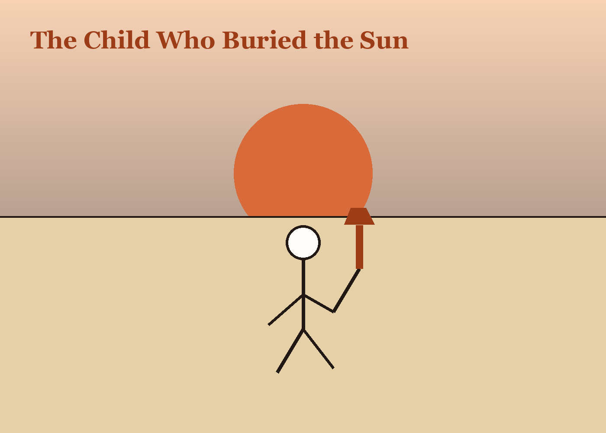

# The Child Who Buried the Sun

A child at the beach announced each evening that she had buried the sun behind the water and would return tomorrow to dig it up.

Adults corrected her until they saw how useless this was.

For one summer the whole shore adopted her theory. Sunset became a labor rather than a spectacle. People packed up blankets with the grave seriousness of custodians. In the morning they greeted dawn as successful excavation.

When autumn came and the family left, the town returned to astronomy. But something in its tone had changed. People spoke less of endings, more of intervals.
