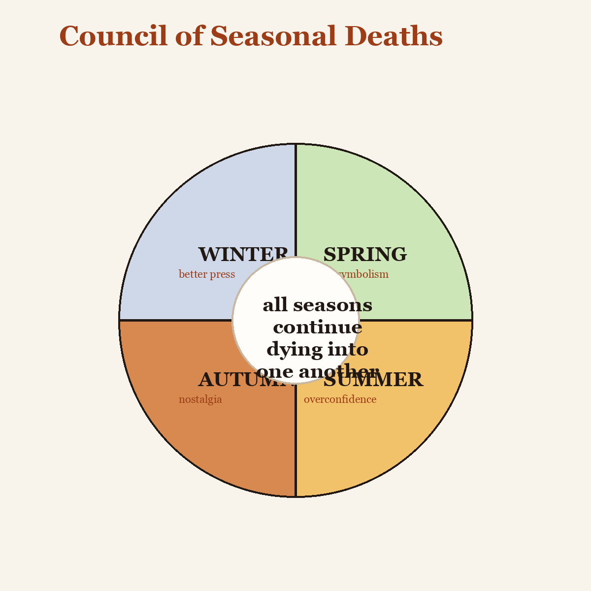

# Minutes from the Council of Seasonal Deaths

Spring apologized for excess symbolism.

Summer objected to repeated allegations of decline, noting that heat is not death but overconfidence.

Autumn accepted responsibility for leaves, nostalgia, and literary overuse.

Winter requested better press.

Motion passed unanimously: all seasons shall continue dying into one another with immediate effect.
