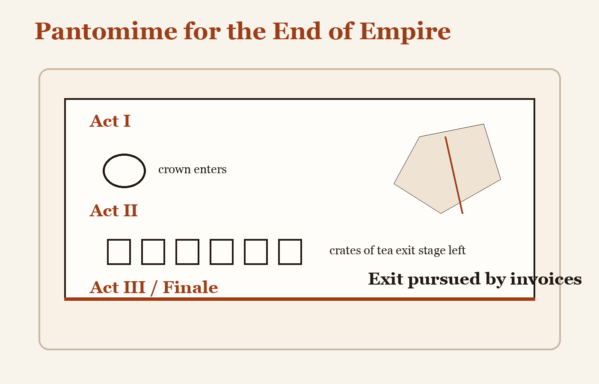

# Pantomime for the End of Empire

**Cast:** one exhausted crown, six crates of tea, a map with delusions, a chorus of ports

**Act I**  
Empire enters in velvet and takes a bow too long for modern budgets.

**Act II**  
The colonies begin removing the stage furniture while Empire is still speaking.

**Act III**  
Empire points at the shrinking map and declares this a strategic abstraction.

**Finale**  
The chorus sings, "Exit pursued by invoices."
