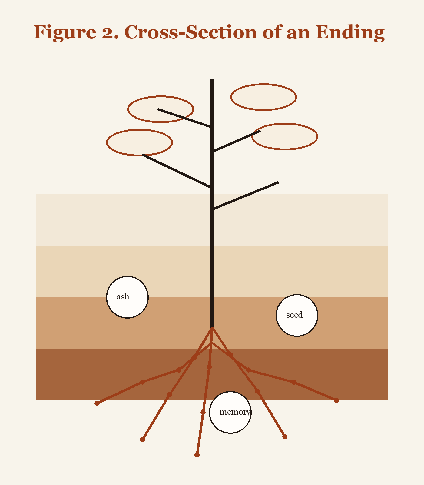

# Sonnet with Figure Caption
::: poem
The old idea collapses in the rain,  
its paper banners running into blue.  
We thought the end would thunder down a train;  
it came instead by being less than true.  

A style goes out. A custom loses face.  
A language sleeps inside a grandchild's jaw.  
The stars burn through one body into space.  
We call it death because we love a law.  

But endings are untidy with return.  
They seed the ditch, the archive, and the street.  
The book shuts once so other pages turn.  
The ash goes cold so kitchens may have heat.  

So mark the loss, but leave the window wide.  
The next world enters where the last one died.
:::

*Figure 2. Cross-section of an ending showing concealed roots.*
