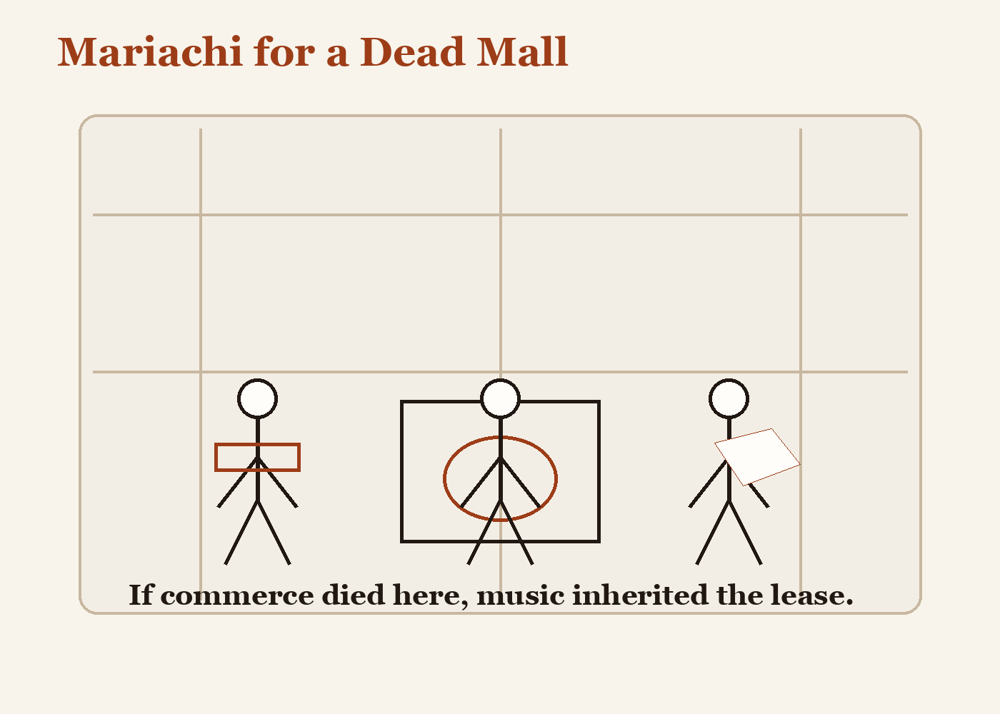

# Mariachi for a Dead Mall

The dead mall had all the usual symptoms: echo, dust, a fountain without conviction, escalators frozen in attitudes of upward mobility.

But on Saturdays a mariachi band came to practice in the abandoned food court because the acoustics were astonishing and no one complained. Trumpets rose past shuttered boutiques. Violins transformed vacancy into occasion. The old mall, which had once sold sneakers and simulated weather, became briefly a cathedral for second uses.

If commerce died there, music inherited the lease.
